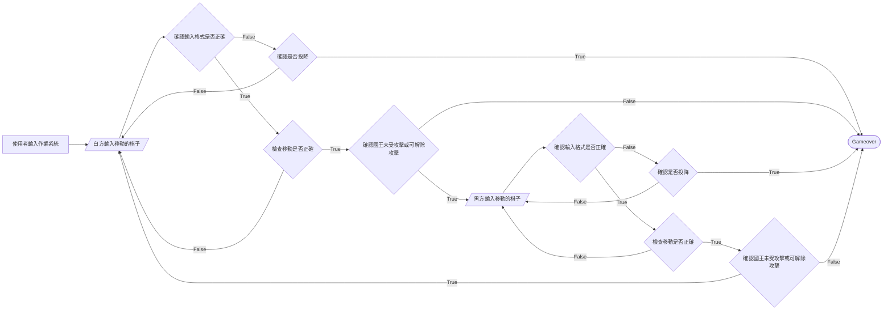
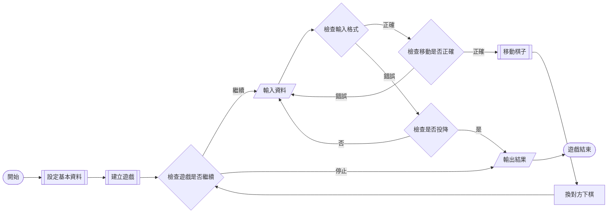

# IDEA
> 記錄臨時的想法與未完成的項目
## 臨時的想法

### 連機遊玩的終端界面
#### Server端
*以下動作皆在終端進行，終端會有相應的提示*
1. 打開程式
2. 設定基本資料
3. 選擇模式(此時選擇連機)
4. 選擇Server端
4. 設定ip
5. 設定port
6. 選擇自己是黑方或白方
7. (此時遊戲建立)
8. 等待對方連線
9. 開啟對局
10. 檢查自己是那一方
11. 若我方為黑方則等待對方下棋，反之白方會先下
#### Client端
1. 打開程式
2. 設定基本資料
3. 選擇連機
4. 選擇Client端
5. 輸入ip
6. 輸入port
7. 等待連線
8. 連線成功時，會得知自己是那一方
9. 檢查自己是那一方

#### 當client得知自己是那方後
##### 白方
1. 使用者輸入移動的資料
2. 在本地檢查資料
3. 若資料正確，在本地執行，否則回到`1.`
4. 執行成功則將此資料傳給server端，否則回到`1.`
5. server端若回傳成功則移動棋子，反之失敗必須再輸入一次資料(回到`1.`)
6. 成功移動棋子
7. 監聽server是否傳訊息
8. 收到訊息後在本地檢查資料
9. 若資料正確，在本地執行，否則回傳失敗回到`7.`
10. 執行結果為失敗則回到`7.`
11. 執行成功則回傳成功
12. 移動棋子
13. 回到`1.`

黑方則是從 `7.`開始
server則是把client對調
##### 所需要的函式
檢查資料
執行
傳送資料
接收資料
##### 簡單版
*白方*
1. 輸入資料
2. 檢查資料
    * 資料錯誤 -> 回到`1.`
3. 執行
    * 執行錯誤 -> 回到`1.`
4. 下棋
5. 將資料傳給Server(Client)
6. 監聽Server(Client)
7. 執行
8. 下棋
> 會這樣設計的前提是，雙方的程式碼都一樣，做出的結果也會一樣，所以不用再檢查一次，相信對方的結果和自己也會一樣。
##### 循序圖
```text
        server              client
          |                     |   
          |                     |   
          | <-----hello-------  |       
          | ----your group--->  |   
          |                     |   
          |#-------------------#|   
          | <-----start-------  | if client is black
          | ----move Info---->  |   
          | <---move Info-----  |   
          |#-------------------#|   
          |         .           |   
          |         .           |   
          |         .           |   
          |#-------------------#|   
          | <----I got it-----  | if client is white
          | ------start------>  |       
          | <---move Info-----  |       
          | ----move Info---->  |       
          |#-------------------#|   
          |         .           |   
          |         .           |   
          |         .           |
          |#-------------------#|  
          | ----move Info---->  |   if server loss
          | <----close()------  |
          |#-------------------#|
          |                     |
          |                     |
          |#-------------------#|
          | <---move Info-----  |   if client loss
          | ----I got it ---->  |     
          | <----clost()------  |     
          |#-------------------#|
          |                     |   
          |                     |   
          V                     V 
```
##### json的資料格式
```json
{
    "command":"",
    "group":"",
    "start":"",
    "end" : ""
}
```
command有以下指令
* move      --> 後面接移動
* surrender --> 接收後結束遊戲
* start     --> 接收後開始遊戲並移動
* wait      --> 將控制權交給對方
* hello     --> 用在開始的打招呼       
* set       --> 用在設定顏色
```text
        server              client
          |                     |   
          |                     |   
          | <---- hello ------  |       
          | ------ set ------>  |   
          |                     |   
          |#-------------------#|   
          | <---- start ------  | if client is black
          | ------ move ----->  |   
          | <----- move ------  |   
          |#-------------------#|   
          |         .           |   
          |         .           |   
          |         .           |   
          |#-------------------#|   
          | <----- wait -----  | if client is white
          | ----- start ----->  |       
          | <----- move ------  |       
          | -------move ----->  |       
          |#-------------------#|   
          |         .           |   
          |         .           |   
          |         .           |
          |#-------------------#|  
          | ------ move ----->  |   if server loss
          | <----close()------  |
          |#-------------------#|
          |                     |
          |                     |
          |#-------------------#|
          | <----- move ------  |       
          | ------ wait ----->  |       
          | <----clost()------  |     
          |#-------------------#|
          |                     |   
          |                     |   
          V                     V 
```

### 新的想法-伺服器做驗證
還是有wait的必要
**時序圖**
```text
        server          client
send      ------init------->    receive
send      ------move------->    receive
reveive   <-----move--------       send
send      ------move------->    receive
receive   <-----move--------       send    
send      ------move------->    receive
receive   <-----move--------       send

send      ----surrender---->    receive
send      -----gameover---->    receive
receive   <-----close-------       send
end                                 end

send      ------move------->    receive
recerive  <---surrender-----       send
send      -----gameover---->    receive
receive   <-----close-------       send

```
command
* init
    * 給予初始資料例如現在的棋盤資料
    * 對手的棋子顏色
* wait
    * 等待接收資料
* move
    * **server**
        * 請下棋
        * 傳送輪到誰下棋
        * 棋盤
    * **client**
        * 棋子的移動
* redraw
    * 表示錯誤，請重新下棋
    * 一樣會標示當下輪到誰 
* gameover
    * 表示遊戲結束
    * 內容包含遊戲的最終資料
* surrender
    * 表示認輸
    * server送出，client等待最終資料
    * client送出，server傳送最終資料

**Json**
server端傳送的資料
```json
{
    "command" : "<command>",
    "color" : "color",
    "board" : []
}
```
client端傳送的資料
```json
{
    "command": "<command>",
    "move" : {
        "start": "<start>",
        "end": "<end>"
    }
}
```

## 目前進度
設計遊戲界面
要求:
1. 容易結合網路連線的需求

### 目前的遊戲進行流程


### 只有一個玩家的遊戲進行流程


## 未完成的項目      

* 勝利條件的判定
    * 有一方勝利
        * ~~有一方國王受到攻擊且不能移動也無法做任何防禦~~
        * 超時
        * 投降
    * 和局
        * 條件
        1. 相同的棋路重複走三次
        2. 只剩國王
        3. 只剩國王跟騎士或主教
        4. 沒有任何棋子可動
        5. 50步內無任何吃子的動作

## 建議完成的順序
~~攻擊範圍表~~ -> ~~國王的規則~~ -> ~~國王受到攻擊提醒玩家~~ -> ~~若移動為解除國王受到攻擊的狀態則不允許玩家移動棋子~~
 -> ~~下棋完整的流程~~ -> ~~小兵的規則~~ ->  勝利條件判定 (-> 用pygame製作出遊戲) -> 嘗試和其他電腦連線遊玩 

## 已完成的項目
* 棋盤的初始化
* 移動棋子的方式
* 主教、騎士、城堡的移動規則
* 檢查棋子移動的方式  
* 國王、皇后、小兵的移動規則
* 小兵的斜吃、升變
* 國王與城堡的特殊規則


----

## 西洋棋的規則
#### 各項棋子的移動方式
* 國王: 以自身為中心的九宮格。移動的範圍內可吃子
* 皇后: 直線、斜線。移動的範圍內可吃子
* 主教: 斜線。移動的範圍內可吃子
* 騎士: 日字(往左或右+1, 往上或下+2; 往左或右+2, 往上或下+1)。移動的範圍內可吃子
* 城堡: 直線。移動的範圍內可吃子
* 小兵: 一次前進一格。**只能斜吃**
#### 特殊規則
##### 國王、城堡
1. 王車移位   
    條件：  
    當城堡與國王間沒有任何棋子和國王與城堡未移動且移位路徑、國王未受到攻擊時可移位。  
      
    方式：
    1. 國王向右移動兩格，城堡移到國王左測並排
    2. 國王向左移動兩格，城堡移到國王右側並排

##### 小兵
1. 斜吃  
當對方棋子在己方小兵左或右前方一格時可吃子，其他地方不行。  

2. 吃過路兵  
條件：對方第一次移動，且移動到己方小兵側邊並排。但**僅限對方移動後輪到自己時的這回合**  
  
方式：吃掉對方且移動到左或右側斜前方一格

3. 底線升變
當小兵到達對方底線時，可選擇生變成：皇后、主教、騎士、城堡其中一個